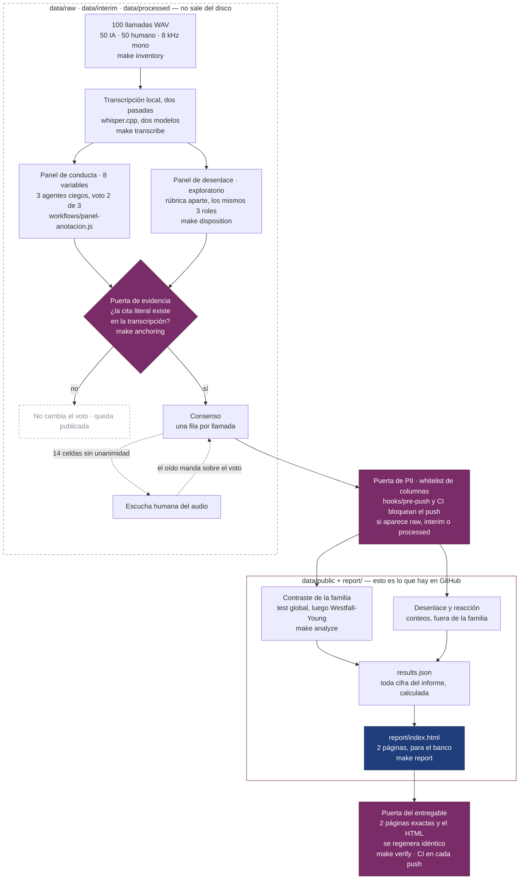

# Agentes humanos frente a agentes de IA en gestión de cobranza

[](https://github.com/mauriciosf2004/crecere-humanos-vs-ia/actions/workflows/ci.yml)
[](https://mauriciosf2004.github.io/crecere-humanos-vs-ia/report/)

Prueba técnica para Creceré AI. Cien llamadas —50 de gestores humanos y 50 de un agente de IA—
convertidas en datos para responder una pregunta: ¿hay diferencias sustentables en cómo gestionan?

**Respuesta corta.** Sí, pero dicen cómo cobra cada canal, no cuál cobra mejor. La IA se presenta
desde un área de embargos y afirma que la oferta vence hoy; en las llamadas humanas se ofrece
sacar al deudor de centrales de riesgo. Qué canal consigue más compromisos de pago no se puede
saber con estas grabaciones: los humanos retomaban sobre todo acuerdos ya pactados y la IA abría
gestiones nuevas. El siguiente paso es un piloto con asignación de cuentas al azar.

Con cifras: se presenta como área de embargos en 43 de 50 llamadas de IA y 1 de 50 humanas;
ofrece salir de centrales de riesgo en 3 de 50 frente a 22 de 50; y 3 de las 4 conductas de riesgo
de la IA son una sola frase de guion repetida, así que se corrigen editándola.

Desde un clon limpio, `make report` regenera `report/index.html` y `git status` queda vacío:
ningún número del informe está escrito a mano.

## Cómo se estructuró el problema

- **Qué se quería entender.** Si los dos canales gestionan distinto, en qué, y si la diferencia se
  puede atribuir al agente o a la cartera que le tocó.
- **Qué variables se construyeron.** Ocho conductas del agente, cada una definida por la presencia de
  una frase concreta: presentarse desde un área de embargos, anunciar que la oferta vence, presentar
  el pago como salida de un proceso legal, ofrecer salir de centrales de riesgo, una compuerta de
  confidencialidad o identidad, proponer cifras, ofrecer cuotas, y obtener un compromiso con fecha y
  monto. Más dos de contexto: contacto efectivo con el titular y acuerdo previo. Ninguna por
  ausencia, ninguna por prosodia: son las que sobreviven a un audio mono de 8 kHz (`src/rubric.md`;
  las 39 descartadas y su motivo, en `docs/variables-descartadas.md`).
- **Qué hipótesis se contrastaron.** Ocho, con dirección declarada y fecha antes de medir; dos
  predecían que no habría diferencia (`docs/hipotesis.md`).
- **Cómo se probaron.** El dato lo produce un panel de tres anotadores ciegos con voto 2 de 3, y
  cada respuesta afirmativa tiene que citar una frase que exista en la transcripción. Cada diferencia
  lleva Fisher exacto e intervalo de Newcombe; un test global por permutación y Westfall-Young
  controlan la familia de ocho. Con 50 llamadas por canal solo se ven diferencias de 29 puntos o
  más, así que los titulares son tamaños de efecto con intervalo, no p-valores (`src/analyze.py`,
  `src/stats.py`).

## De una llamada al informe



Las tres cajas magenta son puertas que fallan y paran el trabajo: la de evidencia no deja que una
cita que no existe en la transcripción cambie el voto del panel; la de PII no deja salir del disco
una fila con texto de llamada; la del entregable no deja publicar un informe de tres páginas ni uno
con una cifra escrita a mano.

## Las cuatro preguntas del encargo

| Pregunta | Respuesta corta | Dónde está |
|---|---|---|
| Desempeño: ¿quién es más efectivo? | En compromisos de pago no hay ganador demostrable | informe, veredicto |
| Explicación: ¿qué explica las diferencias? | El guion (encuadre de embargos, vencimiento, el pago como forma de evitar un proceso legal) y la cartera (acuerdos previos) | `docs/decisiones.md` §10 y §13 |
| Conducta: ¿qué hace mejor cada uno? | Cuando el deudor dice que no puede pagar, la IA reconoce la dificultad y ofrece una alternativa en 15 de 19 llamadas, los humanos en 9 de 22 (conteo, no diferencia medida). Los humanos ofrecen salir de centrales de riesgo en 22 de 50: es una alerta, no una ventaja | informe, página 2 |
| Mejora: ¿qué cambiar? | Tres frases del guion de la IA, un estándar común para los dos canales, 49 llamadas auditadas por periodo, y un piloto con asignación al azar que incluya una IA sin anuncio legal ni vencimiento | informe, «Los hallazgos y qué hacer con cada uno» |

## Por dónde empezar

1. **[El informe](https://mauriciosf2004.github.io/crecere-humanos-vs-ia/report/)** — dos páginas, pensado para imprimirse. El archivo es `report/index.html`.
2. `docs/hipotesis.md` — qué se quería entender, qué se esperaba, la tabla completa de las ocho hipótesis con su resultado, y el pre-registro del desenlace (§7).
3. `docs/decisiones.md` — las decisiones que cambiaron el resultado, cada una con el dato que la sostiene.
4. `docs/panel-de-anotacion.md` — cómo anotan los tres agentes ciegos y por qué se vota 2 de 3.
5. `docs/control-de-calidad.md` — qué cuesta saber que esto sigue acertando con cien mil llamadas.
6. `src/analyze.py` — el contraste estadístico.

`docs/variables-descartadas.md` lista las 39 candidatas que no entraron en la familia y por qué.

## Anotar con agentes, especificado

El trabajo de anotación está especificado, no improvisado, y esa especificación es parte del
repositorio:

| Pieza | Qué gobierna |
|---|---|
| `AGENTS.md` (`CLAUDE.md` es un enlace a él) | El contrato del proyecto: qué se versiona y qué no, la regla de PII, la prohibición de escribir una cifra a mano, y la definición de «hecho» |
| `src/rubric.md`, `src/rubric_desenlace.md` | Las dos rúbricas, congeladas antes de anotar; su huella entra en la caché, así que editarlas invalida las anotaciones |
| `src/schema.json`, `src/schema_desenlace.json` | La salida válida: conjuntos cerrados, sin texto libre |
| `workflows/panel-anotacion.js` | La orquestación: tres roles, dos modelos, reanudable por lotes |
| `docs/hipotesis.md` | El pre-registro: hipótesis, cortes y regla de publicación, con fecha y commit |

La disciplina que lo hace verificable es la misma en todas partes: **cada respuesta afirmativa
obliga a citar una frase literal, y el código comprueba que esa frase exista en la
transcripción**. En la familia de 8 quedaron ancladas 258 de 259, y en el desenlace 182 de 186;
las que no están publicadas con nombre propio en
`data/public/anchoring.json`: el anclaje se mide y se reporta, no se usa para limpiar el dato por
detrás. Lo que sí bloquea es promover una celda: una cita que no existe no puede contradecir al panel.

`src/results.py` cierra el círculo por el otro lado: la prosa del informe declara los supuestos
de los que depende, y si el análisis deja de sostener una frase, el armado falla en vez de
publicarla.

## Sobre el diseño

El informe usa la identidad de Creceré AI —su magenta y Poppins— con una regla que lo gobierna
todo: **el rosa es identidad, no información**. El rosa de marca tiene 2,67:1 de contraste sobre
blanco, así que no pasa ni el umbral para elementos gráficos: va como filete de firma y nada más.
Donde la familia rosa tiene que leerse se usa `#7a2c68`, que da 8,80:1.

Los colores de los datos no son de marca sino de legibilidad: el informe se fotocopia y las dos
series se separan 21,8 de ΔL* en escala de grises. El magenta secundario de la marca queda a 2,5
del ocre, indistinguible impreso, así que no entra.

Poppins va **embebida en base64** dentro del HTML (24 KB, subconjunto latino, licencia SIL OFL;
ver `report/fonts/LICENSE.txt`) y solo en títulos y rótulos. Embebida, el informe se compone
igual en cualquier máquina: sin eso, un Linux sin las caras del sistema cae en una más ancha y se
va a tres páginas, que es justo lo que CI detectó.

## Qué hay en el repositorio y qué no

```
src/               análisis: inventory → transcribe → annotate → analyze → anchoring → disposition → results → report
src/rubric*.md     las dos rúbricas y su salida válida (schema*.json), congeladas antes de anotar
workflows/         la orquestación del panel de tres agentes
docs/              hipótesis pre-registradas, decisiones, control de calidad, variables descartadas
data/public/       lo único con datos que se versiona: conteos y variables derivadas, sin texto de llamadas
data/reference/    precios y normas, con su fuente
report/            template.html.j2 e index.html, el entregable; fonts/ con Poppins y su licencia
hooks/pre-push     bloquea el push si aparece data/raw, interim o processed
tests/             estadística, voto del panel, anclaje, costos, informe
data/raw|interim|processed   audios, transcripciones y anotaciones de deudores reales. NO se versionan
```

La tabla analítica completa, una fila por llamada, es `data/public/features.csv`.

## Requisitos

Python 3.11 o superior con [uv](https://docs.astral.sh/uv/). Con eso corren `make report`,
`make check` y, si hay Google Chrome y `pdfinfo` (poppler), `make verify`; `make help` lista todo.
El pipeline completo necesita además los audios, `ffmpeg`, `whisper-cli` (paquete `whisper-cpp` de
Homebrew) y el CLI de Claude Code.

Antes de tocar nada: `git config core.hooksPath hooks`. Activa el hook que bloquea cualquier push
con datos de llamadas —es la única comprobación del proyecto que no se puede deshacer, y CI llega
tarde para ella.
